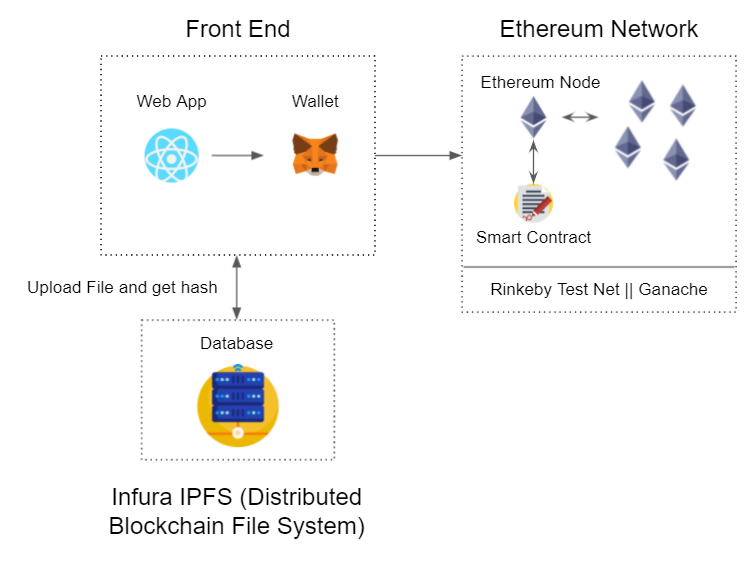

# Open River 🚀 
##### OpenRiver is powered by Ethereum smart contracts, specifically designed for buying and selling unique digital assets.
---
## Table of Contents
* [Prerequisites](#Prerequisites)
* [Description](#Description)
* [System Design](#system-design)
* [Setup](#Setup)
  + [FrontEnd](#frontend)
  + [SmartContracts](#smart-contracts)
* [Preview](#Preview)
* [FrontEnd](#FrontEnd)
* [Smart Contracts](#Smart-Contracts)
* [Test Cases](#testcase)
* [Summary](#summary)
## Prerequisites  
- [NodeJS](https://nodejs.org/en/)
- [React](https://reactjs.org/)
- [Truffle](https://www.trufflesuite.com/)
- [Ganache](https://www.trufflesuite.com/ganache)
- [MetaMask](https://metamask.io/)*
- [Infura](https://infura.io/)
- [IPFS](https://ipfs.io/)

*Please note that you have to switch your MetaMask wallet Network to the ```Rinkeby test network```. 
To get test Ether coins on the Rinkeby network, please visit [Rinkeby Authenticated Faucet](https://faucet.rinkeby.io/)
## Description
By having an open market for digital assets, it is possible to verify digital art as the blockchain network itself is able to function as certificates of authenticity. 

A sample use case scenario can be as follows:

As a digital artwork designer, although I am able to watermark my own images, Photoshop is available to mask the watermark and someone is able to copy the particular style or image by simply copying the digital file and editing the image and claim it to be theirs thus I will be unable to sell my artwork. As such, to prove my work, I can first hash my digital image and upload the hashed value to the blockchain network. In this project, we will make it seamless for an average joe to access the client application via a Dapp. By uploading and selling my art piece to anyone on the internet, it becomes a commodity which breeds a new stance of economy in the digital art scene. At the same time, the buyer is able to claim that they purchase the rights from my artwork. This can be proved by looking at the publicly available transaction ledger found in our Dapp website. 

This Dapp application has few core advantages over a typical centralised marketplace. Firstly, it ensures immutability and accountability of everyone’s digital assets. The unique property of Immutability for a blockchain is that it cannot be tampered with and thus the owner of each digital asset is indisputable. Therefore, this is the key property that makes our Dapp relevant in this scenario.

Secondly, this Dapp relies on smart contracts as a means of contract between the buyer and seller does not require a trusted 3rd party to verify and execute transactions. This decentralisation model significantly reduces any intermediary costs. Plus, this platform is built on the Ethereum Blockchain which uses Proof of Work consensus (Ethereum 2.0 is Proof of Stake). This ensures that the platform is trustless and prevents double spending attacks. Nodes are also incentivised to participate as honest nodes that do good work and get rewarded through block rewards.

Lastly, OpenRiver relies on secure cryptographic encryption to ensure that the seller’s artwork belongs to him. Thus, if someone else tries to claim that artwork for himself in the blockchain he/she will be rejected. This is because the smart contract will check the blockchain if that artwork already exists, if yes this new claim will be rejected. Thus, this ensures that the ownership of this unique artwork only belongs to the first person who uploaded it. Preventing any counterfeits of this image.

In conclusion, leveraging a smart-contract enabled marketplace has its merits over a centralised marketplace. A smart-contract enabled marketplace is in itself distributed and prevents a central point of failure ensures high availability. Open River incorporates the above mentioned features to make it a safe and secure marketplace for digital assets enthusiasts. 

## System Design  



## Setup

Ensure you have Truffle globally installed

```bash
npm install -g truffle
```

### Frontend  
Clone and install required pacakges
```bash
git clone https://github.com/tengfone/open-river
cd open-river
npm install
```
```Please ensure that you have a ```.env``` file located at the root directory that consist of the following params:
```
REACT_APP_ETHERSCAN_TOKEN=GETFROMETHERSCAN
```
Then you can ```npm run start``` to start the frontend server.

### Smart Contracts
##### For development (Only if Ganache is connected locally):  
```bash
truffle migrate --reset
```

##### For deployment to Rinkeby Test Network:
Please ensure that you have a ```.env``` file located at the root directory that consist of the following params:
```
 mnemonic="SOME WEIRD PHRASES THAT MAKES NO SENSE"
 tokenKey="https://rinkeby.infura.io/v3/{secretToken}"
```
To retrieve ```mnemonic```, please ensure you have MetaMask installed and follow these [instructions](https://metamask.zendesk.com/hc/en-us/articles/360015290032-How-to-Reveal-Your-Seed-Phrase-Secret-Recovery-Phrase) on how to retrieve the mnemonic phrase.
To retrieve ```tokenKey```, create an account in [Infura](https://infura.io/). Create a new project and change Endpoints to "Rinkeby" test net. Copy the URL and paste over.

Ensure you have enough Test Ether in your primary account in MetaMask which is connected to the Rinkeby Test Network. i.e First account in your MetaMask Wallet. Then run:

```bash
truffle migrate --network rinkeby --reset --compile-all
```

## Preview

[](https://www.youtube.com/watch?v=xTbkRUNYkqI)  

## FrontEnd

The Front end is written in ReactJS and wallet be powered by MetaMask, a browser plugin that is a software cryptocurrency wallet used for interaction with the Ethereum network. Below is a list of features we implemented: 
| Feature | Description |
|---|---|
| Buy a digital artwork | Buyers are able to purchase digital artwork(s)  listed on the blockchain. If the buyer fulfils the predetermined conditions (e.g. price) of the smart contract, it automatically executes, updating the state of the blockchain by transferring funds to the seller and the digital asset to the buyer. |
| Upload digital artwork | Sellers are able to upload their artwork to the blockchain. To prove the ownership of the artwork, we could apply a hashing algorithm of the file || seller’s address. Plus, a timestamp is attached to the ledger to further prevent someone else from claiming the ownership of the artwork.  |
| View personal collection  | Users are able to keep stock of the digital assets they own and display the image files of these assets. The hash of the images is mapped to the original image file in a separate centralised database. |
| View public transaction | Anyone on the blockchain network is able to check the validity and the ownership of the artwork.  |
| Check balance | Users are able to check their remaining ethereum balance that is linked to their wallet (i.e. metamask).  |

## Smart Contracts
| Function                                                                                           | Description                |
|----------------------------------------------------------------------------------------------------|----------------------------|
| uploadArtwork(string memory _name, uint _price, string memory _description,string memory _imgHash) | Uploading of artwork       |
| purchaseProduct(uint _id)                                                                          | Purchasing of each artwork |
## Test Cases
| Test Case | Description | Test Steps | Expected Outcome |
|---|---|---|---|
| Deployment of Smart Contract | Check for deployment of smart contract | Deploy Smart Contract on blockchain | True |
| Create Artwork | Creation of Artwork and appending to blockchain | 1. Upload Artwork with parameters name:"Testname", price:"1ETH",description:"descp",hash:"Testhash" <br/> 2. Check logs in output of function Id Name Owner address isPurchased Imghash Description <br/> 3. 2 negative test cases(Should be rejected) <br/> Case 1: Did not feed imageHash param <br/> Case 2 : name/descp field is empty <br/> Case 3: 0 wei fed as price of artwork | True |
| Purchase Product | Buying an artwork, transferring ownership from seller to buyer, transferring price of artwork from buyer to seller | Purchase Product with ID,last ID in product mapping <br/> Check new owner is the same address as buyer’s address <br/> Check the balance of the seller is expected(oldBalance+Price of artwork) | True |
## Summary
We would like to attribute that Open River is inspired by [OpenSea](https://opensea.io/). 
Future works can be explored such as having the type of digital assets, etc.
Feel free to fork this repo to continue the project but please provide the attributes accordingly.
